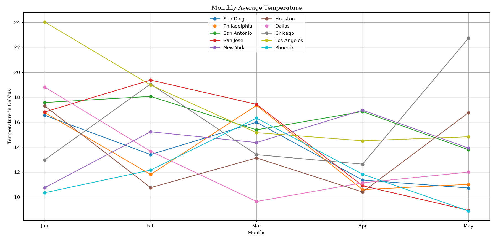
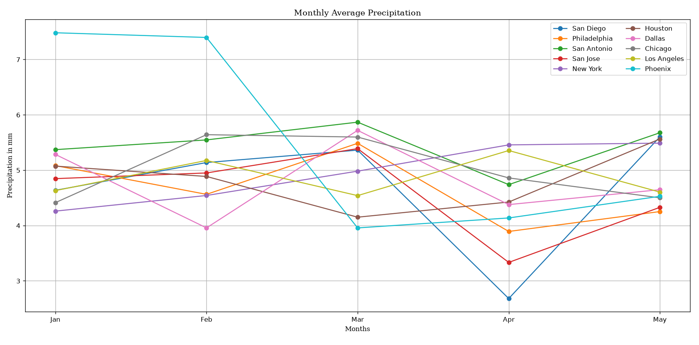
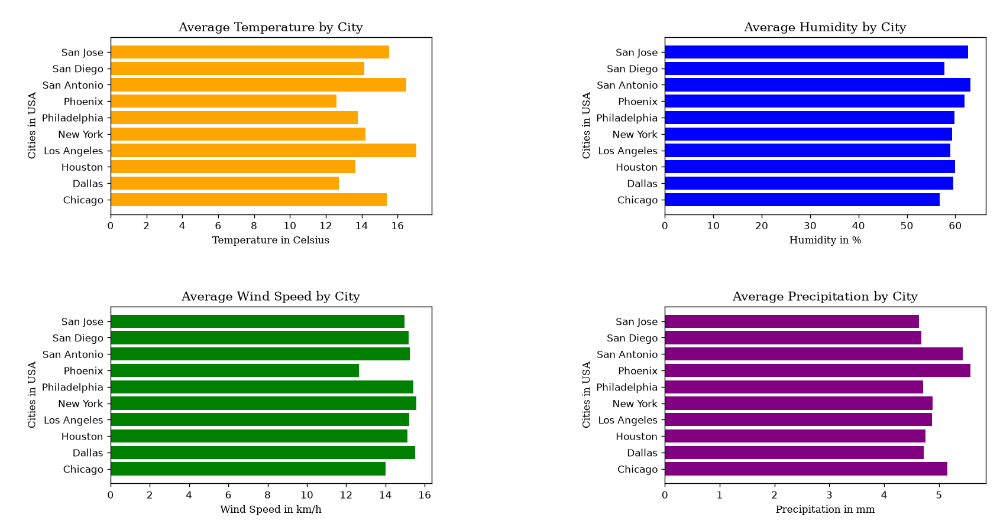
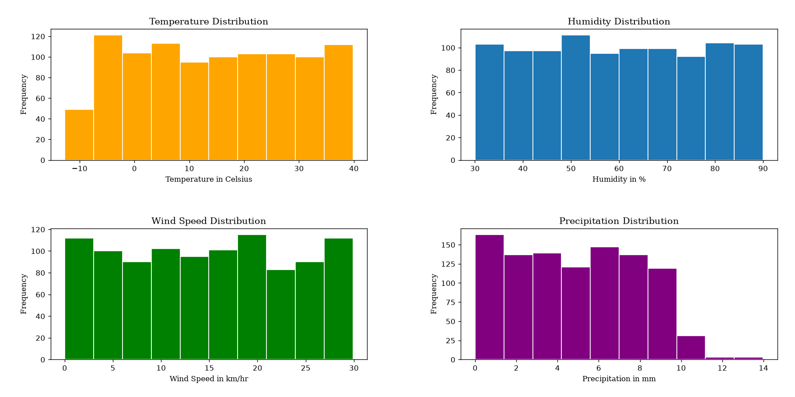

# Weather-Data-Analysis-Project

> This project performs Data Analysis pn Weather Dataset using Python, Pandas and Matplotlib. It analyzes multiple weather conditions across multiple cities of USA, by calculating average termperature, humidity, precipitation and wind speed, along with monthly trends and visualizations.

## Tech Stack
- Python
- Pandas
- Matplotlib

## Graphs

# Monthly Temperature

# Monthly Precipitation

# Average Temperature by City

# Weather Parameter Distribution 

# Correlation Matrix

